  <!-- Custom Animated Glassmorphism Header Banner -->
  

    

  <!-- Quick Social Badges -->
  
  
  
  

 

### 👨‍💻 About Me

Experienced **Full Stack Software Engineer** passionate about building robust, scalable web applications and real-time systems. I specialize in modern JavaScript ecosystems (**React, Next.js, Node.js, Express**) along with relational & NoSQL databases (**MongoDB, MySQL**), web security, and IoT solutions.

- 🔭 **Currently Building:** High-performance web applications and backend services (`BREAT Platform` & `CurrentNai`).
- ⚡ **Focus Areas:** Web Development, RESTful & Real-time APIs, Database Design, Clean Code.
- 🎓 **Research & Innovation:** Computer Vision, Accessibility Solutions, and IoT Safety Systems.
- 💬 **Ask me about:** React, Next.js, Node.js, Express, JavaScript, Database Queries & Web Development.
- 📫 **Reach me:** `zobaerislamshanto@gmail.com`

---

### 💻 Tech Stack & Tools

<table>
  <tr>
    <td width="50%" valign="top">
      <h4>🌐 Frontend Ecosystem</h4>
      
      
      
      
      
      
      
    </td>
    <td width="50%" valign="top">
      <h4>⚙️ Backend & API Development</h4>
      
      
      
      
      
      
    </td>
  </tr>
  <tr>
    <td width="50%" valign="top">
      <h4>🗄️ Databases & Storage</h4>
      
      
      
    </td>
    <td width="50%" valign="top">
      <h4>🛠️ Tools, Hardware & Platforms</h4>
      
      
      
      
      
      
    </td>
  </tr>
</table>

---

### 🚀 Featured Engineering Projects

<table>
  <tr>
    <td width="50%" valign="top">
      <h3 align="center">📊 CurrentNai</h3>
      
Real-Time Bangladesh Power Outage & Grid Monitoring Platform

      

        <code>React</code> • <code>Next.js</code> • <code>Node.js</code> • <code>GeoJSON</code>
      

      

        <a href="https://github.com/zobaer29/current_nai_frontend"><b>View Repository »</b></a>
      

    </td>
    <td width="50%" valign="top">
      <h3 align="center">⚡ BREAT Platform Backend</h3>
      
High-concurrency REST API & Data Store Service for BREAT Ecosystem

      

        <code>Node.js</code> • <code>Express</code> • <code>MongoDB</code> • <code>JWT</code>
      

      

        <a href="https://github.com/zobaer29/breat-backend"><b>View Repository »</b></a>
      

    </td>
  </tr>
  <tr>
    <td width="50%" valign="top">
      <h3 align="center">👁️ Color Vision Deficiency Tool</h3>
      
Personalized Image Processing & Computer Vision Accessibility Solution

      

        <code>Python</code> • <code>OpenCV</code> • <code>Computer Vision</code>
      

      

        <a href="https://github.com/zobaer29/Personalized-Color-Vision-Deficiency"><b>View Repository »</b></a>
      

    </td>
    <td width="50%" valign="top">
      <h3 align="center">🤖 UIU AI Chatbot</h3>
      
Intelligent Assistance & Natural Language Response Agent

      

        <code>Python</code> • <code>NLP</code> • <code>JavaScript</code>
      

      

        <a href="https://github.com/zobaer29/uiu_chatbot"><b>View Repository »</b></a>
      

    </td>
  </tr>
</table>

---

### 📈 GitHub Insights & Statistics

  
  

 

  

 

  

---

  

